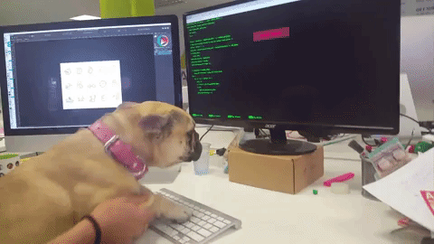

<h1 align ="center"> Hello World ¯\_(ツ)_/¯ :)</h1>

    <h3 align="center"> 🛸 👾 👽 🇮🇹</h3>

    

    <b>𝓤𝓷 𝓫𝓾𝓰 𝓷𝓸𝓷 𝓮` 𝓶𝓪𝓲 𝓼𝓸𝓵𝓸 𝓾𝓷 𝓮𝓻𝓻𝓸𝓻𝓮. 𝓡𝓪𝓹𝓹𝓻𝓮𝓼𝓮𝓷𝓽𝓪 𝓺𝓾𝓪𝓵𝓬𝓸𝓼𝓪 𝓭𝓲 𝓹𝓲𝓾`. 𝓤𝓷 𝓮𝓻𝓻𝓸𝓻𝓮 𝓷𝓮𝓵 𝓶𝓸𝓭𝓸 𝓭𝓲 𝓹𝓮𝓷𝓼𝓪𝓻𝓮.</b>

### 🔗 1. <u>Who I am?</u>  👨‍💻📚💯

Sure, here's a possible professional introduction you could use for your GitHub profile as an IT expert and programming enthusiast with a passion for hacking:

Hello everyone, I'm an IT expert and programming enthusiast with a passion for hacking. I develop software and applications, explore system vulnerabilities, and enjoy pushing technological limitations.

    
    
<i><b>LOL !</b></i>

I'm always seeking new challenges and opportunities to learn in the world of ethical hacking and programming. I hope to collaborate with the GitHub community and share my passion for technology.

 

### 🔗 2. <u>what languages do you know?</u> 🗣️🖧

    

I have extensive knowledge of numerous languages, including: <mark>C/C++ /Python /Java /Bash / VBA</mark> ecc.. and love sharing my code with the open-source 
community. I have developed specific legal and regulatory expertise, 
which enables me to provide IT consulting and technical support in cases of legal disputes.

 

### 🔗 3. <u>Contact me</u> 🤙🏼💯

    

Thank you for visiting my profile, and please don't hesitate to contact me for any questions or collaboration.

- [Gmail](https://mail.google.com/mail/u/0/?tab=km#inbox?compose=CllgCHrgmLCPBRBtTvXVkcWcNNTSZSSZfbDFNHCPmBhfNrTtPQLlKqtvHxWnDqqNqKkWCxnmTbq)

- [Telegram](https://t.me/fsistemy)

